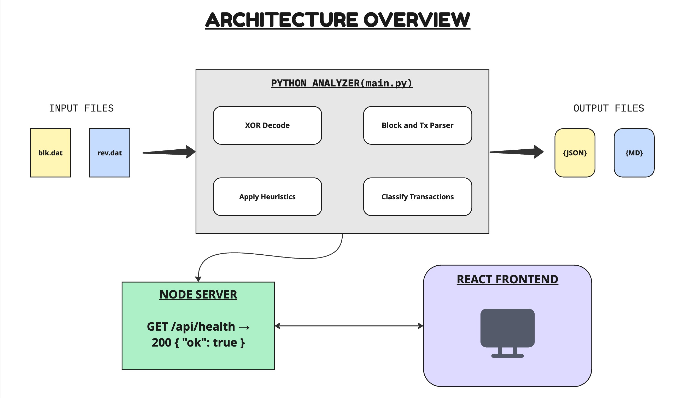

# Approach

## Heuristics Implemented

### 1. Common Input Ownership Heuristic (CIOH)

**What it detects:** When a transaction has multiple inputs, they are likely controlled by the same entity (wallet/user). This is because signing inputs requires knowledge of the corresponding private keys.

**How it is detected/computed:** Triggered when `num_inputs > 1` AND the transaction is not a coinbase. All inputs flagged as likely belonging to the same cluster.

**Example:**

```code
Inputs: 3
Outputs: 2

CIOH triggered because multiple inputs are spent together.
```

**Confidence model:** High for simple payments. Lower for CoinJoin (where inputs are intentionally mixed from multiple owners).

**Limitations:** CoinJoin transactions intentionally group inputs from multiple parties, causing false positives. Mixing services exploit this limitation by design.

---

### 2. Change Detection

**What it detects:** Identifies which output is "change" returned to the sender. Change detection helps identify payment flows and receiver vs. change addresses.

**How it is detected/computed:** Two sub-signals: (a) **Script type matching** — if exactly one output's script type matches the dominant input script type (and the other outputs differ), that matching output is likely change; (b) **Round number payment** — if one output has a round value (divisible by 1,000,000 sats = 0.01 BTC), the non-round output is the change.

**Example:**

```code
Input: 0.5 BTC
Outputs:
0.10 BTC
0.399 BTC

The 0.399 BTC output is likely change because it is not a round value and matches the sender's script type.
```

**Confidence model:** Medium. Combination of both signals increases confidence. Single signal alone may have false positives.

**Limitations:** Does not apply to transactions with all same-type scripts or no clear dominant input type. P2SH-wrapped SegWit adds ambiguity.

---

### 3. Address Reuse

**What it detects:** When a transaction's outputs reuse a script/address that also appears in the inputs (via the undo/rev data). This indicates the sender is sending back to their own address.

**How it is detected/computed:** Hash the compressed scriptPubKey of each input (from undo data) and each output. Flag if any output hash matches an input hash.

**Example:**

```code
Input address: bc1abc...
Output address: bc1abc...

Address reuse detected.
```

**Confidence model:** High confidence when detected. Address reuse is a privacy concern and often indicates change or self-transfer.

**Limitations:** Requires undo data (rev file) for input scripts. Without rev data, only inferred from script type patterns.

---

### 4. CoinJoin Detection

**What it detects:** Identifies coordinated mixing transactions where multiple parties combine inputs and outputs to obfuscate transaction graphs.

**How it is detected/computed:** Triggers when `num_inputs >= 3` AND there are `>= 2` equal-value outputs (each > 546 sats dust threshold). The equal-value outputs suggest multiple participants each receiving the same denomination.

**Example:**

```code
Inputs: 10
Outputs:
0.05 BTC
0.05 BTC
0.05 BTC
0.05 BTC

Equal-value outputs suggest a CoinJoin-style mix.
```

**Confidence model:** Medium-high. Equal-value outputs are a strong signal of CoinJoin coordination.

**Limitations:** False positives possible for batch payments to equal amounts. Does not detect all CoinJoin variants (e.g., PayJoin, Wasabi non-equal-output mixing).

---

### 5. Consolidation

**What it detects:** Transactions that merge many UTXOs from the same wallet into fewer outputs, typically to reduce future fee overhead.

**How it is detected/computed:** Triggers when `num_inputs >= 3` AND `num_outputs <= 2`. High input count with minimal outputs is the hallmark of a consolidation sweep.

**Example:**

```code
Inputs: 12
Outputs: 1

Wallet consolidating many smaller UTXOs into a single output.
```

**Confidence model:** High confidence for miners or exchanges consolidating change.

**Limitations:** May overlap with CoinJoin patterns. Some batch payments also have few outputs.

---

### 6. Self Transfer

**What it detects:** Transactions where value moves within the same wallet with no net change to the owner's balance.

**How it is detected/computed:** Triggers when `num_inputs == 1` AND `num_outputs == 1` (single in, single out). Also detected when all output script types match all input script types.

**Example:**

```code
Inputs: 1
Outputs: 1

Likely internal wallet movement rather than a payment.
```

**Confidence model:** Medium. Single in/single out is a strong signal. Script type matching adds supporting evidence.

**Limitations:** Simple payments can also be 1-in/1-out if the sender pays exactly the right amount with no change.

---

### 7. Round Number Payment

**What it detects:** Payments denominated in round amounts (multiples of 0.01 BTC = 1,000,000 sats) suggest a human-initiated transfer to a third party.

**How it is detected/computed:** Checks if any output value is exactly divisible by 1,000,000 satoshis and is non-zero. Such round amounts rarely arise from automated fee calculations.

**Example:**

```code
Outputs:
0.01000000 BTC
0.00348172 BTC

The round value (0.01 BTC) is likely the payment output.
```

**Confidence model:** Medium. Round amounts are common in human-initiated payments but also appear in exchange withdrawals at round BTC amounts.

**Limitations:** Exchange withdrawals and some protocol transactions also use round values. Cannot definitively distinguish payment from self-transfer.

---

## Architecture Overview



The solution uses a pure Python 3 (stdlib only) CLI analyzer (`src/analyzer/main.py`) and a Node.js + React web frontend.

**Data flow:**

1. `cli.sh --block <blk.dat> <rev.dat> <xor.dat>` invokes `src/analyzer/main.py`
2. The analyzer XOR-decodes the block data (using the 8-byte key from `xor.dat`), then scans for the mainnet magic bytes (`0xF9BEB4D9`) to locate individual block records
3. Each block's 80-byte header is parsed for: version, prev_hash, merkle_root, timestamp, bits, nonce; block hash is SHA256d(header)
4. BIP34 coinbase height is decoded from the coinbase scriptSig (first push = LE-encoded height)
5. Transactions are parsed with full SegWit support (marker `0x00 0x01` detection, separate witness data)
6. txid = SHA256d(non-witness serialization), wtxid = SHA256d(full serialization)
7. Output scriptPubKeys are classified into P2PKH, P2SH, P2WPKH, P2WSH, P2TR, OP_RETURN, or unknown
8. All 7 heuristics are applied to each transaction
9. Only the first block (`blocks[0]`) gets a full `transactions[]` array; subsequent blocks use `transactions: []` to keep JSON size manageable
10. Results are written to `out/<blk_stem>.json` and `out/<blk_stem>.md`

**Key modules:**

- `parse_blk_file()`: scans for magic, reads block records sequentially
- `parse_transaction()`: handles both legacy and SegWit transactions
- `parse_rev_file()`: reads undo data (Coin records) for prevout values
- `apply_heuristics()`: applies all 7 heuristics and returns a dict
- `classify_transaction()`: assigns one of 6 classifications based on heuristics
- `compute_fee_rate_stats()`: computes min/median/mean/max fee rates

---

## Trade-offs and Design Decisions

- **Python stdlib only**: I intentionally avoided external libraries so the analyzer can run in minimal local environments. `struct.unpack_from` is fast enough for large block files while keeping setup simple.
- **First-block-only transactions**: only `blocks[0]` contains full transaction data. This keeps JSON output smaller, speeds up report loading, and still gives the visualizer detailed transaction data for interactive inspection.
- **Fee rates from rev data**: the rev file contains compressed Coin records (prevout values) needed to compute fees. The compression format uses Bitcoin Core's `CompressAmount` and `CScriptCompressor` encodings.
- **Heuristic selection**: the 7 heuristics balance coverage (common patterns like consolidation and CoinJoin) with precision (avoiding trivial false positives).
- **Classification priority**: coinjoin > consolidation > self_transfer > batch_payment > simple_payment > unknown, to handle transactions that match multiple patterns.

---

## References

- [BIP34](https://github.com/bitcoin/bips/blob/master/bip-0034.mediawiki): Block v2, height in coinbase
- [BIP141](https://github.com/bitcoin/bips/blob/master/bip-0141.mediawiki): Segregated Witness
- [BIP340](https://github.com/bitcoin/bips/blob/master/bip-0340.mediawiki): Schnorr Signatures (P2TR)
- [BIP341](https://github.com/bitcoin/bips/blob/master/bip-0341.mediawiki): Taproot
- [BIP125](https://github.com/bitcoin/bips/blob/master/bip-0125.mediawiki): Replace-by-Fee
- Bitcoin Core source: `compressor.cpp`, `validation.cpp`, `serialize.h`
- Ron Dinn et al., "An Analysis of Anonymity in the Bitcoin System" (2013) — foundational CIOH paper
- Meiklejohn et al., "A Fistful of Bitcoins" (2013) — address clustering and change detection
